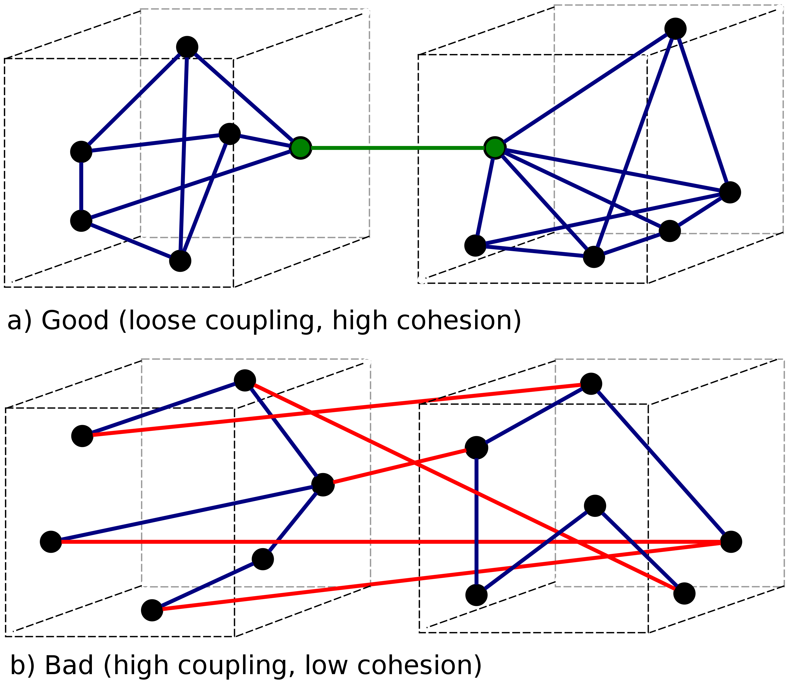
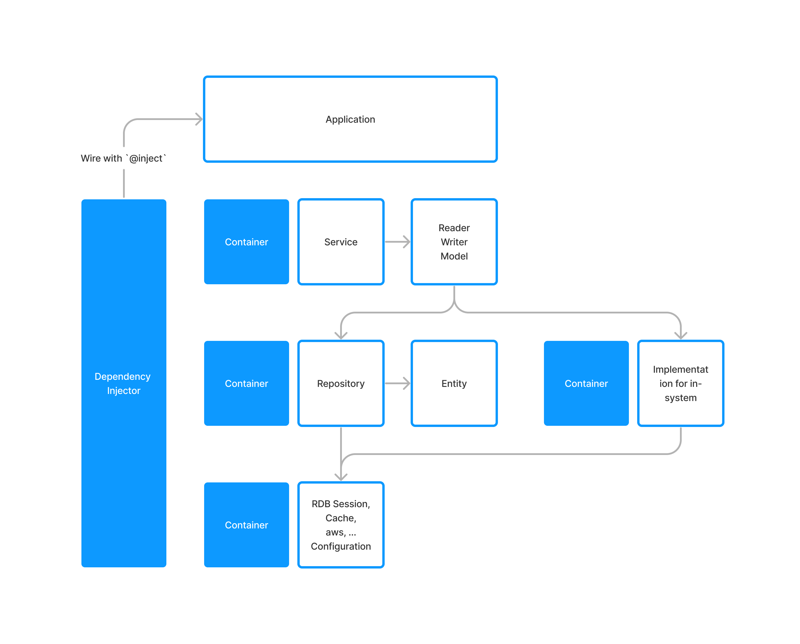

# 📦 FastAPI Containerized Multimodule Project Template

FastAPI Boilerplate, with stricter Dependency Injection.

## Dependencies
- FastAPI
- [Dependency Injector](https://github.com/ets-labs/python-dependency-injector)
- Pydantic V2
- SQLAlchemy (asynchronous support)
- Boto3

## What is "Dependency Injection"?

> In software engineering, dependency injection is a programming technique in which an object or function receives other objects or functions that it requires, as opposed to creating them internally. 
> Dependency injection aims to separate the concerns of constructing objects and using them, leading to loosely coupled programs. 
> The pattern ensures that an object or function which wants to use a given service should not have to know how to construct those services. 
> Instead, the receiving 'client' (object or function) is provided with its dependencies by external code (an 'injector'), which it is not aware of. 
> Dependency injection makes implicit dependencies explicit and helps solve the following problems: 
> 
> - How can a class be independent from the creation of the objects it depends on?
> - How can an application, and the objects it uses support different configurations?
> - How can the behavior of a piece of code be changed without editing it directly?
> 
> Dependency injection is often used to keep code in-line with the dependency inversion principle.

## low coupling, high cohesion

> Coupling is usually contrasted with cohesion. Low coupling often correlates with high cohesion, and vice versa. Low coupling is often thought to be a sign of a well-structured computer system and a good design, and when combined with high cohesion, supports the general goals of high readability and maintainability.
> 

# Structure of the project

### References
- [Dependency Injection](https://en.wikipedia.org/wiki/Dependency_injection)
- [Inversion of Control](https://en.wikipedia.org/wiki/Inversion_of_control)
